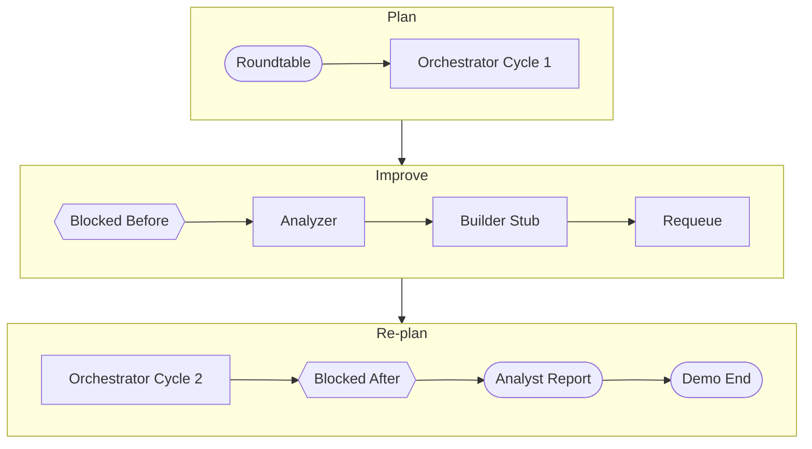

# Demo logs and Mermaid workflow visualizer (updated plan)

## Overview

Add structured demo logging to `Demo_logs.txt` (JSON lines) and an HTML+JS page that fetches those logs and renders a **visually appealing** Mermaid workflow chart in the browser (subgraphs, top-to-bottom flow, varied node shapes, legend for counts).

---

## 1. Structured demo log format

**File:** [run_demo.py](GTM_agent_auto_mode_on/run_demo.py)

- Write demo events to **`Demo_logs.txt`** in the project root (overwrite per run for a fresh log).
- Use **JSON lines** (one JSON object per line) so the browser script can parse line-by-line. Each event has at least `event` and `ts` (ISO timestamp).

**Events to log:**

| Event | Fields (in addition to `event`, `ts`) |
|-------|----------------------------------------|
| `demo_start` | `topic` |
| `roundtable_done` | `tasks_published`, `summary_preview` (first 80 chars) |
| `orchestrator_cycle_1_done` | `max_messages`, `time_limit_sec` |
| `blocked_before` | `task_count`, `blocked_item_count` |
| `analyzer_done` | (none) |
| `builder_stub_done` | `added_count`, `added_slugs` (array) |
| `requeue_done` | `requeued` |
| `orchestrator_cycle_2_done` | `max_messages`, `time_limit_sec` |
| `blocked_after` | `task_count`, `blocked_item_count` |
| `analyst_report` | `report_preview` (first 200 chars or full if short) |
| `demo_end` | `blocked_before_count`, `blocked_after_count` |

**Implementation in run_demo.py:**

- Add `_demo_log(event: str, **kwargs)` that writes one JSON line to `Demo_logs.txt` (open in append mode; include `ts` from `datetime.now(timezone.utc).isoformat()`).
- At start of `main()`, open `Demo_logs.txt` in write mode and close (truncate for fresh run), then use append for each `_demo_log(...)`.
- Call `_demo_log(...)` at each step after we have the relevant values.

---

## 2. Visually appealing Mermaid structure (updated)

**New file:** [demo_viz.html](GTM_agent_auto_mode_on/demo_viz.html)

The JS should build a **flowchart** with:

### 2.1 Subgraphs (narrative bands)

Group steps into three bands so the "plan → improve → re-plan" story is clear:

- **Plan** – Roundtable → Orchestrator Cycle 1  
- **Improve** – Blocked Before → Analyzer → Builder Stub → Requeue  
- **Re-plan** – Orchestrator Cycle 2 → Blocked After → Analyst Report → Demo End  

Use **top-to-bottom** (`flowchart TB`) and **subgraphs** so each band is one visual block. Edges: last node of Plan → first node of Improve → last node of Improve → first node of Re-plan.

### 2.2 Node shapes (by role)

- **Roundtable / Analyst Report / Demo End:** `stadium` (rounded pill) – human-facing or terminal steps.  
- **Blocked Before / Blocked After:** `hexagon` – status/decision-like steps.  
- **Orchestrator, Analyzer, Builder Stub, Requeue:** `rectangle` or `round` – execution steps.

Use Mermaid shape syntax, e.g. `A([Roundtable])` for stadium, `C{{Blocked Before}}` for hexagon, so the chart is easier to scan than a wall of identical boxes.

### 2.3 Short labels in diagram; counts in a legend

- **In the diagram:** Short labels only (e.g. "Roundtable", "Orchestrator Cycle 1", "Blocked Before", "Analyzer", "Builder Stub", "Requeue", "Orchestrator Cycle 2", "Blocked After", "Analyst Report", "Demo End").  
- **Below the diagram:** A **stats/legend** section populated from parsed events (e.g. "Tasks published: N | Blocked before: K | Tools added: M | Requeued: R | Blocked after: L") so the flow stays clean.

### 2.4 Example Mermaid output (target structure)

The script builds this from the event list (only include nodes for events that exist in the log). Stats section below: pull `tasks_published`, `blocked_before.task_count`, `builder_stub_done.added_slugs`, `requeue_done.requeued`, `blocked_after.task_count` from the parsed events.

### 2.5 Implementation details for demo_viz.html

- Load **Mermaid.js** from CDN (e.g. `https://cdn.jsdelivr.net/npm/mermaid/dist/mermaid.min.mjs`).
- `fetch("Demo_logs.txt")` to load the log file (page must be served over HTTP; e.g. `python -m http.server 8080` from project root, then open `http://localhost:8080/demo_viz.html`).
- Parse response: split by newline, for each non-empty line `JSON.parse(line)` to get events.
- Build the Mermaid flowchart string from the event list (subgraphs, TB, node shapes as above), then render with `mermaid.render()` into a `
`.
- Add a `
` below the diagram and fill it from the parsed events (tasks published, blocked before/after counts, tools added, requeued).
- Handle missing/empty `Demo_logs.txt` or parse errors: show a short message ("No demo logs yet. Run the demo first.").

---

## 3. Scope and files

| Deliverable | Description |
|-------------|-------------|
| **Demo_logs.txt** | Created/overwritten each demo run; JSON lines of events. |
| **_demo_log() in run_demo.py** | Helper that appends one JSON line to Demo_logs.txt. |
| **demo_viz.html** | Single HTML file; fetches Demo_logs.txt, parses JSON lines, builds Mermaid flowchart with subgraphs + node shapes, renders in browser; stats legend below. Serve via `python -m http.server 8080`. |

---

## 4. Summary

- **Logging:** Demo-only; structured JSON lines in `Demo_logs.txt` from [run_demo.py](GTM_agent_auto_mode_on/run_demo.py).  
- **Viz:** Subgraphs (Plan / Improve / Re-plan), TB flow, stadium/hexagon/rectangle shapes, stats section below. No flat chain; narrative bands and shape variety for a more visually appealing workflow chart.
